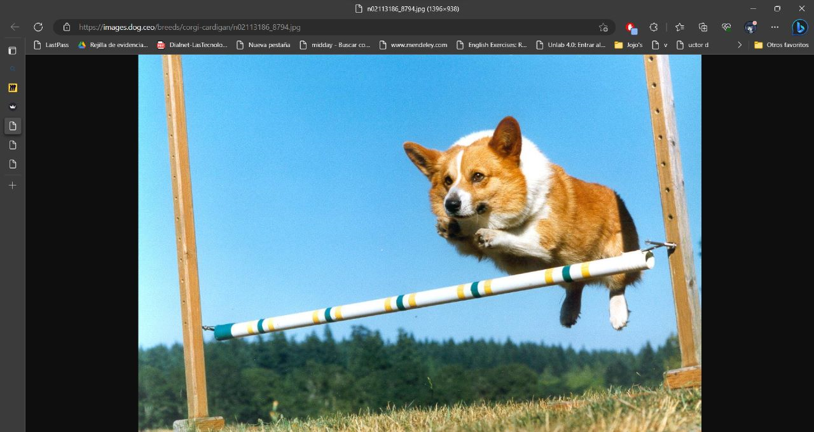

# POOProject2

## *Manual técnico*
* **Zoológico RF**

  Nuestro proyecto consiste en una pequeña simulación del funcionamiento de un zoológico 
  teniendo en cuenta tres aspectos del mismo: **habitats, animales y alimentos**,
  además de tratar de representar cómo interactúan entre ellos y bajo qué condiciones
  podrían funcionar de la manera en la que se espera lo hicieran en la vida real.

***

* **Imagen del diagrama UML**

 <https://miro.com/app/board/uXjVMG5LnUE=/?share_link_id=574599693702>
***
  * **Funcionamiento del programa**
    * Inicio del programa

      En el momento en el que por consola damos la instrucción
    _streamlit run main.py_, aquello que vemos en la interfaz gráfica es lo siguiente:
    
    Observamos que el programa tiene en total 10 opciones;
    las cuáles se manejan a nivel de código con el archivo _zoo.py_ encargado de la parte de la
    _vista_ del programa.
    
    * Agregar un habitat

       
     Al agregar un habitat, este se inserta en una lista de habitats almacenada en el sistema del
     zoológico. Y al llamarlo con la tercera opción, podemos ver algo así:
     
     Y así se ve si deseas ingresar un hábitat con el mismo id, por ejemplo. De esta manera podemos asegurar
    que no habrá un habitat con un identificador igual, esto nos ayudará a manejar las modificaciones del
    proyecto y el acceso a sus elementos, de manera segura.
    
    Luego de agregar un par de habitats más, esta lista se puede ver así:
    
    Nótese que hay dos hábitats con el mismo tipo (acuático), pero esto solo puede ocurrir
    si su alimentación es diferente; de lo contrario, el habitat no se ingresará al sistema.
    * Agregar un animal 
    
    Estos son los datos que se piden al usuario para agregar el animal. Esta opción ingresa a los
    animales a una especie de "refugio", en donde se van a mantener hasta que se agregue a un hábitat.
    Así lo podemos ver en mostrar habitats y animales disponibles.
    
    * Ingresar a un animal del refugio al habitat
    
      Para ingresar un animal al habitat, es necesario que coincida tanto el habitat, como el tipo de alimentación;
    de lo contrario, se verá en pantalla que la información no concuerda; por tanto no se puede agregar a ese animal
    al habitat que se escogió.
    
    Sin embargo, en caso de que concuerden, se verá de esta manera:
    
    Se verifica si se agregó correctamente accediendo a la opción que nos mostrará los animales del habitat.
    
    
    * Alimentar a un animal
    
      Para alimentar a un animal primero se verifica si hay animales y alimentos. Como ya sabemos que
    se ingresaron animales, el error que se presenta solo informará que no hay alimentos para los animales.
    
    De esta manera lo primero que hacemos es agregar un alimento al zoológico mediante la opción
    Agregar un alimento, lo cual desplegará una pestaña así:
    
    Luego de esto podemos verificar en la lista de alimentos que efectivamente se ingresó al zoológico
    
    De esta manera, al seleccionar la opción de alimentar, esto no se dará si el animal no tiene un tipo de
    alimentación que corresponde con la categoría del alimento.
    
    Luego de crear otro alimento y ofrecérselo a un animal cuya dieta fuese correspondiente, logramos que el animal coma:
    
    Además de que el nuevo alimento "matas" ya no aparecerá en el inventario, pues ya se lo comieron
    
    * Enviar a dormir a un animal

      Para que esta opción se ejecute correctamente, se necesita que el animal que se escoja no haya dormido, además
    de que las horas que se le den deben ser exactas (ni más ni menos)
    
    
    Al darse la opción exacta de horas:
    
    En la siguiente ejecución además, si seleccionamos el mismo animal, este no podrá dormir, pues ya
    cumplió con el tiempo de sueño que le correspondía en el día
    
    * Jugar con un animal

      Para jugar con un animal, el único requisito es que no haya jugado en el día, esto se maneja con
      un atributo llamado "haJugado".
    
    Si tratamos de ejecutar esta opción con un animal que ya ha jugado (es decir, con un animal al que ya se
    le haya aplicado la función), la respuesta será que no se puede ejecutar esa acción pues el animal ya 
    ha jugado en el día.
    
    * Mira nuestras mascotas
      Esta opción será la encargada de hacer una consulta a una API. Esta API contiene imágenes de perritos aleatorios
    
    Al tocar el botón ¡Perritos!, aparecerán imágenes como la siguiente:
    
***
Ese es a grandes rasgos nuestro proyecto

# Informe de autoevaluación

# Laura Franco
## _Problemas al hacer el proyecto_
>Personalmente no considero que hubiese problemas como tal, pues la palabra es bastante pesada, pero algunas cosas por mejorar son por ejemplo la poca costumbre de migrar de un lenguaje a otro. Pues al menos por mi parte tenía muchas cosas de C++ guardadas en cuanto a código y me confundía ocasionalmente con los operadores, pero teniendo la ayuda de mi compañero y del mismo PyCharm, fue superable.

## _¿Qué aprendimos?_
>Aprendimos a usar creo que por primera vez algo que construyera interfaces así de bonitas para hacer una interacción con el usuario. Lo cual es bastante útil tanto para la universidad como para el trabajo en momentos futuros.

## _¿Qué nos gustó?_
>En lo personal, me pareció súper interesante streamlit, y siento que durante vacaciones estaré buscando un poco la manera de aprender un poco más de él y tal vez tratar de comenzar proyectos manejando esta plataforma. Pues aún queda mucho en la documentación que sé que servirá para muchas otras aplicaciones.

## _¿Qué no nos gustó?_
>No me gustó no tener todavía como la capacidad de dividir esos conocimientos en cuanto a formato del código y organización de este en un lenguaje diferente y sentí un poco frustración como ya lo mencioné porque sentía que, aunque sabía cómo hacer las cosas, tenía errores muy simples y eso me bajaba los ánimos.

## _¿Qué hizo cada uno de los miembros?_
>Con mi compañero fue un trabajo realmente muy interesante a mi forma de ver, porque todo lo que hicimos fue desde mi computador, dado a algunos problemas que él tuvo con el suyo, fue más fácil reunirnos por horas y trabajar y aportar de manera física al trabajo. Así que no puedo mencionar si hubo algo en específico que hiciera cada uno, pues siento que todo fue muy cooperativo en todas las partes del trabajo.

## _¿Qué nota se pondrían de manera individual y a su compañero?_
>Tanto de manera individual como para mi compañero, daría la misma nota; un 5.0, pues a pesar del reto que representó el proyecto para nosotros, lidiamos con él bastante bien e hicimos lo mejor que pudimos

*** 
# Jhon Ríos
## _Problemas al hacer el proyecto_
>Para mí fue un problema el no tener equipo, siento que nos retrasó un poco porque todo lo que avanzamos lo tuvimos que hacer estando juntos y aunque no fue una mala dinámica, sé que hubiésemos podido terminar el trabajo más rápido o de manera diferente.

## _¿Qué aprendimos?_
>Aprendimos realmente a trabajar en estos dos proyectos con las exigencias de un proyecto de programación real; la tensión del tiempo, delegar trabajo en equipo, comunicación y errores que debían solucionarse en poco tiempo porque además esta semana estuvo llena de trabajos.

## _¿Qué nos gustó?_
>Me gustó bastante el manejo de streamlit y de las API’s, me parece muy interesante y nos da como un abrebocas para lo que veremos en semestres siguientes.

## _¿Qué no nos gustó?_
>No me gustó mucho pasar de C++ a Python, sentí el cambio un poco brusco y cuando sentí que me había acostumbrado a C++ pasamos a Python y los primeros momentos fue un caos con mi compañera para recordar todo respecto a operadores y forma del código.

## _¿Qué hizo cada uno de los miembros?_
>Manejamos muy de la mano, pero siento que porté más o al menos tenía más para aportar a nivel de instrucciones de código de la parte interna del programa. Más relacionado a los bancos de datos y eso.

## _¿Qué nota se pondrían de manera individualy a su compañero?_
>Nos pondría un 5.0 fue a mi parecer un buen proyecto.
 
